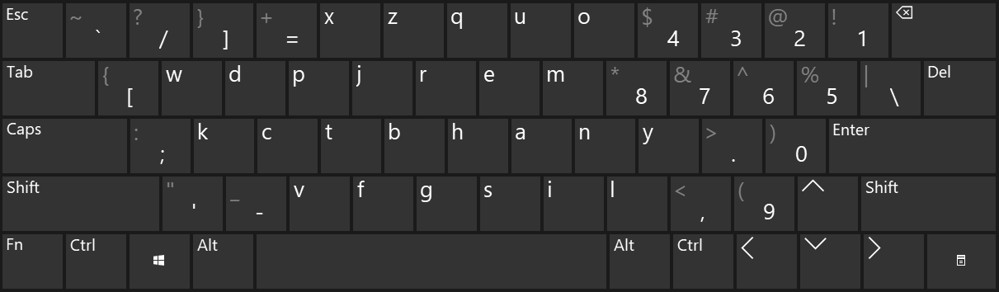

# Layman keyboard layout

## What



## Why

The [Dvorak, Colemak, Workman](https://en.wikipedia.org/wiki/Keyboard_layout#Non-QWERTY-based_Latin-script_keyboard_layouts), and other keyboard layouts inspired me to make this yet-another alternative keyboard layout. There are many like it, but this one is mine.

A few notes or principles, which perhaps sound nebulous or pointless to focus on, but IMO make a pretty darn nice keyboard:

* The shape of a hand resting on the keyboard does not align itself to any home row, rather, the shape is more of a "home curve".
* The [most frequent letters](https://en.wikipedia.org/wiki/Letter_frequency#Relative_frequencies_of_letters_in_the_English_language) should be in places where the hand is ready to type them.
* What feels for me to be the most effortless way to type two letters in succession is by using the index & middle fingers for the respective first & second letters, and, by having the first & second letters at an angle that goes naturally with how the hand rests on the keyboard. Pressing the keys `h` and `e` with the right hand is a prime example of this "finger dance".
* [Bigrams](https://en.wikipedia.org/wiki/Bigrams#Bigram_frequency_in_the_English_language) are most desirably in this finger dance arrangement.
* [Trigrams](https://en.wikipedia.org/wiki/Trigram#Frequency) as well as the higher-order *n*-grams can hint at where the lower-order *n*-grams might best be placed.
* When running out of candidate adjacent pairs to place the bigrams, the second letter can actually be placed on the *opposite* side of the keyboard instead. The intuition is, both hands can type the letters concurrently.

Even less important yet neat details:

* The `'` and `;` keys are in the bottom-left, next to `Shift`. I find typing `"` and `:` quite easy.
* Similarly, `Ctrl-C` and `Ctrl-V` are neighboring and may be done with just the left hand.
* All brackets -- `()<>[]{}` -- use the finger dance arrangement mentioned above, ready for the right hand to go. (On some physical keyboards, however, the `Esc` key may push the `]`/`}` key over one square as in the image above.)

Some notes I've gathered from working with this keyboard for years now:

* I haven't "forgotten" how to type with QWERTY. In fact, I use QWERTY every day on my phone. That said, I type remarkably more accurately and marginally faster on Layman than on QWERTY.
* When I'm using someone else's QWERTY keyboard and want to start a quotation (or String) with `"`, I often accidentally type `Z` instead, since it's in the same position as where I'd expect the `'` key to be.
* Similarly, when I want to type `:` on QWERTY, I often accidentally type `A` instead, for the same reason.

## How

If you're interested in using this yourself, keep in mind, I'm right-hand dominant, speak English, live in the US, and program daily, and each of these details went into the making of Layman.

### Linux

Using [`xkb`](https://wiki.archlinux.org/title/X_keyboard_extension)

```bash
xkbcomp layman.xkb $DISPLAY
```

Or using the [`xmodmap`](https://wiki.archlinux.org/index.php/xmodmap)

```bash
xmodmap layman.xmodmap
```

Place either of these in your `~/.xinitrc` like so

```bash
test -f /path/to/layman.xkb && xkbcomp /path/to/layman.xkb $DISPLAY
```

### macOS

I'll get to it, soon.

### Windows

Run `setup.exe` in [the latest `layman.zip`](https://github.com/almonds0166/layman/releases) if you want to install.

Open `layman.klc` with [Microsoft's Keyboard Layout Creator](https://www.microsoft.com/en-us/download/details.aspx?id=22339) if you want to modify.

## To-do

* layout build for macOS (will likely use Ukelele)
* look into better install for more Linux systems
* deadkeys? (altgr accent capabilities)
